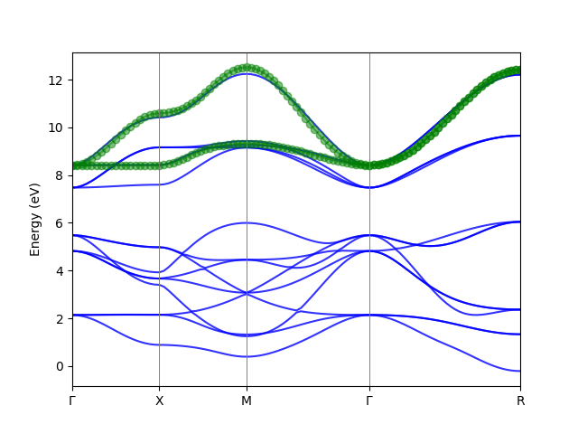
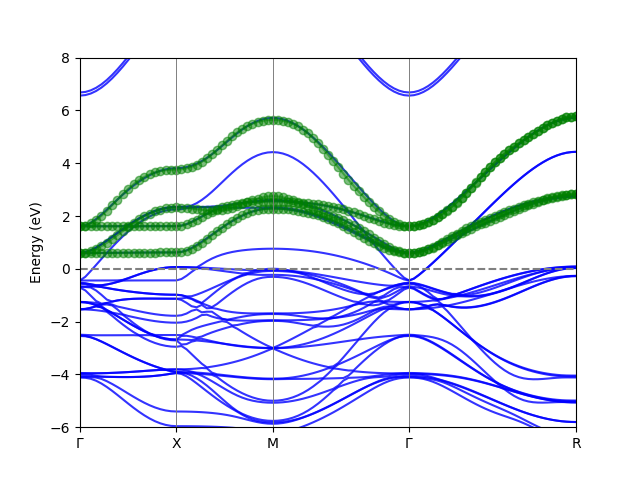

### Electron Wannier function

#### The k <-> R transformation

lawaf stores downfolded models on an R-grid and interpolates back to
arbitrary k with a plain Fourier sum. Two conventions exist:

* **Grid mode** (`use_ws_distance=False`, legacy): the R grid is the
  Monkhorst-Pack cell `[-N/2, N/2]^3`; equivalent R vectors each carry the
  full DFT coefficient together with a degeneracy weight `Rdeg`, which is
  applied at every R-sum.
* **Wigner-Seitz mode** (`use_ws_distance=True`, default): for each pair
  (i, j) and mesh vector R, the matrix element is scattered to the closest
  supercell image `R + n*N` with weight `1/ndeg` — exactly wannier90's
  `ws_distance` treatment. The resulting `Rdeg` is all ones, so every
  plain-sum consumer (band interpolation, supercell folding) is
  wannier90-correct without further changes.

Both modes reconstruct the same Hamiltonian at the mesh k-points; the
Wigner-Seitz mode additionally gives the correct phase averaging at
arbitrary k, especially for even meshes and basis sets with off-center
Wannier functions.

#### Downfolding from Wannier90 Hamiltonian
Below is an example of how to use downfold an tight-binding Hamiltonian from Wannier90 output. 

We need to write a python script (e.g. downfold.py) to call the Downfolder. I'll explain the code line by line.

The W90 Hamiltonian is the spin down part for an SrMn$O_3$. The orginal wannier functions consist the O $2p$ and Mn $3d$ orbitals. We want to downfold the Hamiltonian to a two band Mn $e_g$ model.  

```python
from lawaf.interfaces import W90Downfolder
import numpy as np


def main():
    # Read From Wannier90 output
    # The w90 output
    model = W90Downfolder(folder='./SMO_wannier/',
                          prefix='abinito_w90_down')

    # Downfold the band structure.
    params = dict(method='scdmk',
                  kmesh=(3, 3, 3),
                  nwann=2,
                  weight_func='Gauss',
                  weight_func_params=(10.0, 3.0),   # (mu, sigma)
                  selected_basis=None,
                  anchors={(0, 0, 0): (12, 13)},
                  anchor_kpt=None,
                  use_proj=True,
                  exclude_bands=[])
    model.downfold(**params,
                   write_hr_nc='Downfolded_hr.nc',
                   write_hr_txt='Downfolded_hr.txt')

    # Plot the band structure.
    model.plot_band_fitting(kvectors=np.array([[0, 0, 0], [0.5, 0, 0],
                                               [0.5, 0.5, 0], [0, 0, 0],
                                               [.5, .5, .5]]),
                            knames=['$\Gamma$', 'X', 'M', '$\Gamma$', 'R'],
                            npoints=100,
                            savefig='Downfolded_band.png')


if __name__ == "__main__":
    main()

```

After running the script, we get the output of Wannier functions (in Downfolded_hr.txt and Downfolded_hr.nc) and the band structures of the orginal/downfolded Wannier functions as below.



* Now we dig into the example script, we first import the module W90Downfolder:

  ```python
  from lawaf.interfaces import W90Downfolder
  import numpy as np
  ```

* Next we read the Wannier90 output, which is in the folder directory and the prefix of these outputs. Note that the W90 Hamiltonian file has a _hr in the prefix and we do not need to specify this.

  ```
  model = W90Downfolder(folder='./SMO_Wannier/',
                            prefix='abinito_w90_down')
  ```

* Next we can do the downfolding. 

  - The method is first performed for each k-point in a BZ, and the
  - There are two methods implemented: the scdm-k method and the projected Wannier function method. Both use the same set of parameters.  The parameters are below. 

  - There are three methods to specify the bands we need to build the wannier functions from. First is that we can give some anchor points, e.g. the band with index 12 and 13 at $\Gamma$, given as
 ```
  nwann=2,
  anchors={(0,0,0):(12,13)},
  selected_basis = None,
  anchor_kpt = None,
 ```

The second method is we could select the basis from the original Wannier functions. E.g. in this example we could select the two $e_g$ orbitals of Mn (indices 0 and 3).  Only one of the two method should be used. e.g.

```
  nwann=2,
  anchors=None
  selected_basis = [0,3],
  anchor_kpt = None,
```

   The third method is that we only give an anchor kpoint. It will then try to find the best fitting in the given energy weight function in the anchor-kpoint. e.g.

```
nwann=2,
anchor_kpt=(0,0,0),
anchors=None,
selected_basis=None
```
Note that the three methods cannot be used in the simutaneously. Therefore, the parameters for the ones not in used should be set by None (which are the defaults).

  - In addition to the anchor points or the selected_basis, a energy weight function can be specified to indicate where the band we need are located, given by the parameters weight_func, mu, and sigma. 


  ​	==Note==: All the indices are zero-based. 

  - We use a strategy to select the band by projecting to the anchor points. It can improve the disentanglement significantly if the energy weight function is not obvious. By setting use_proj to True we can enable it. 
  - The Hamiltonian can be outputted to txt and netcdf file. The latter is strongly recommended. But if the netcdf library is not easy to install in your environment, the txt file is also a good choice. By setting the parameter to None, the output is dis-activated. 

```

        Downfold the Band structure.
        The method first get the eigenvalues and eigenvectors in a Monkhorst-Pack grid from the model.
        It then use the scdm-k or the projected wannier function method to downfold the Hamiltonian at each k-point.
        And finally it Fourier transform the new basis functions(Wannier functions) from k-space to real space.
        The Hamiltonian can be written.

        Parameters:
        ====================================
        method:  the method of downfolding. scdmk|projected
        kmesh,   The k-mesh used for the BZ sampling. e.g. (5, 5, 5)
                 Note that for the moment, only odd number should be used so that the mesh is Gamma centered.
        nwann,   Number of Wannier functions to be constructed. 
        weight_func,   # The weight function type. 'unity', 'Gauss', 'Fermi', or 'window'
         - unity: all the bands are equally weighted.
         - Gauss: A gaussian centered at mu, and has the half width of sigma.
         - Fermi: A fermi function. The Fermi energy is mu, and the smearing is sigma.
         - window: A window function in the range of (mu, sigma)
        weight_func_params: the parameters of the weight function. For Gauss and Fermi this is (mu, sigma);
                 for window it is the energy range (Emin, Emax).
        selected_basis, A list of the indexes of the Wannier functions as initial guess. The number should be equal to nwann.
        anchors: Anchor points. The index of band at one k-point. e.g.(0, 0, 0): (6, 7, 8)
        anchor_kpt: used for auto selecting of anchors. Only the kpoint. e.g. (0,0,0)
        use_proj: Whether to use projection to the anchor points in the weight function.
        exclude_bands: the list of bands not considered in the disentanglement.
        write_hr_nc: write the Hamiltonian into a netcdf file. It require the NETCDF4 python library. use write_nc=None if not needed.
        write_hr_txt: write the Hamiltonian into a txt file.

```

* After we get the downfolded model, we can compare the band structures to see if we get a reasonable result. 

  ```
  model.plot_band_fitting(kvectors=np.array([[0, 0, 0], [0.5, 0, 0],
                                                 [0.5, 0.5, 0], [0, 0, 0],
                                                 [.5, .5, .5]]),
                              knames=['$\Gamma$', 'X', 'M', '$\Gamma$', 'R'],
                              supercell_matrix=None,
                              npoints=100,
                              efermi=None,
                              erange=None,
                              fullband_color='blue',
                              downfolded_band_color='green',
                              marker='o',
                              ax=None,
                              savefig='Downfolded_band.png',
                              show=True)
  ```

  The documeation of the parameters is below:

  ```
          Parameters:
          ========================================
          kvectors: coordinates of special k-points
          knames: names of special k-points
          supercell_matrix: If the structure is a supercell, the band can be in the primitive cell.
          npoints: number of k-points in the band.
          efermi: Fermi energy.
          erange: range of energy to be shown. e.g. [-5,5]
          fullband_color: the color of the full band structure.
          downfolded_band_color: the color of the downfolded band structure.
          marker: the marker of the downfolded band structure.
          ax: matplotlib axes object.
          savefig: the filename of the figure to be saved.
          show: whether to show the band structure.
  
  ```

  

### Output

* Downfolded_Hr.txt file:

  The Hamiltonian is outputed to a txt file. The hamiltonian is in real space, given in the form of $H(i,j,R)$.  There are interactions between orbitals in the neighboring unitcells, threrefore we need a $R$ vector to specify the cells of the orbital $j$.   $H(i,j,R)$ is the hopping term between the $i$th Wannier function in the original cell and the $j$th Wannier function in the cell. The on-site energy for orbital $i$ is  H(i,i,R=(0,0,0))  The header of the file contains the number of the cells (Number of R). The number of Wannier functions in the downfolded model. 

  In the Hamiltonian, the H(i,j, R) are grouped by the $R$ vectors.

```
Number_of_R: 27
Number_of_Wannier_functions: 2
Hamiltonian:
============================================================
index of R: 0.  R = [-1 -1 -1]
R = [-1 -1 -1], i = 0, j=0 :: H(i,j,R)= 0.0036+0.0000j
R = [-1 -1 -1], i = 0, j=1 :: H(i,j,R)= -0.0000-0.0000j
R = [-1 -1 -1], i = 1, j=0 :: H(i,j,R)= -0.0000+0.0000j
R = [-1 -1 -1], i = 1, j=1 :: H(i,j,R)= 0.0036+0.0000j
------------------------------------------------------------
....
```

#### Downfolding from Siesta LCAO Hamiltonian.
We take SrMnO$_3$ cubic structure as an example (The files can be found in example/Siesta/SrMnO3_SOC directory.) 
Durint the siesta SCF calculation, we need the following parameters to save the Hamiltonian and the overlap matrices. 
```
SaveHS  True
CDF.Save True
SaveHS True
```
After running siesta, we can proceed.

==NOTE== We use [sisl](http://zerothi.github.io/sisl/docs/latest/index.html) to load the siesta outputs. It need to be installed before you follow the example.
```
pip install sisl
```

We write a python script similar to the example above. The difference is that we read the siesta output instead of Wannier, by specifying the path and the name of the fdf file. A extra parameter spin can be specified. For non-polarized and spin-orbit calculation, it should be set to None. For collinear spin calculation, spin=0 or 1 gives the up and down channel of the band structure. 

```
downfolder = SiestaDownfolder(fdf_fname='siesta.fdf', params=params)
```

In this example, spin-orbit coupling is activated in the siesta calculation. We build the Mn 4 $e_g$ band with spinor wavefunctions.  We can select four anchor points. 

```
        anchors={(.0, .0, 0): [46, 47, 48, 49]},
```

We get the following band downfolding result. 



### Non-orthogonal Wannier functions

By default every Wannierization orthonormalizes its gauge, so the overlap
of the Wannier basis is the identity and the interpolated bands come from
a standard eigenproblem. With `orthogonal=False` (projected method) the
raw projected gauge is kept instead, and the overlap is propagated
through the whole pipeline:

$$
S^w(k) = (\psi_k A_k)^\dagger\, S_k\, (\psi_k A_k) = A_k^\dagger A_k
\qquad
H^w(k) = A_k^\dagger \varepsilon_k A_k
$$

using the S-orthonormality $\psi^\dagger S \psi = 1$ of the generalized
eigenproblem $H \psi = S \psi \varepsilon$. The overlap is Fourier
transformed to `SwannR` (Wigner-Seitz folded together with `HwannR` and
the amplitudes), persisted in the netCDF output, and band interpolation
solves the pencil `(H^w(k), S^w(k))` (`solve_k` does this
automatically). This is the natural output when downfolding from a raw
Siesta NAO Hamiltonian (`SiestaDownfolder` uses `orth=False` for the
basis), but it works for orthogonal parent models too, where
$S^w(k) = A_k^\dagger A_k$ simply measures the non-orthonormality of the
gauge:

```python
params = dict(method="projected", kmesh=[2, 2, 2], orthogonal=False, ...)
wann = downfolder.downfold()
wann.SwannR            # (nR, nwann, nwann) overlap in real space
wann.solve_k(kpoint)   # generalized eigenproblem (H^w(k), S^w(k))
```

Any full-rank gauge reproduces the retained bands exactly on the
downfolding mesh (Rayleigh-Ritz identity), so orthonormality is a choice
of localization, not of correctness. Two caveats: keep full-rank
projections (use `weight_func="unity"`; energy/window weights zero out
rows and are designed to be undone by the polar orthonormalization), and
expect a somewhat larger real-space truncation error when interpolating
far off the mesh, because the raw gauge is less smooth in k. See
`example/Siesta/SrMnO3_SOC/downfold_nonorthogonal.py` for a runnable
spinor example (Mn-3d + O-2p window of SrMnO3).

Two combinations are refused rather than silently degraded:
`method="mlwf"` requires orthonormal gauges (ADR-3), so
`orthogonal=False` there raises `NotImplementedError`; and any per-k
band weighting (energy/window weights, hand-selected `window_bands`)
makes the raw gauge rank-deficient at the selection arms, which raises
a `ValueError` with k context instead of a scipy failure at solve
time. Disentanglement (`mlwf` with `dis_*` windows, or `window_bands`
selections) therefore pairs with the default orthonormal gauge;
non-orthogonal gauges are the full-rank projected path.

#### Constant GL gauge transform (`nonorthogonal_gauge`)

The composable route to non-orthogonal Wannier functions on any parent:
run the standard orthonormal pipeline (any method, including `mlwf`,
`dis_*` windows and `window_bands` selections), then apply a constant
full-rank matrix $G$ to the gauge, $A'(k) = U(k)G$:

```python
params = dict(method="mlwf", ..., nonorthogonal_gauge=G)  # (nwann, nwann)
```

The overlap becomes onsite-only, $S^w(R) = G^\dagger G\,\delta_{R0}$,
the Hamiltonian range is unchanged ($H^w \to G^\dagger H^w G$), and the
pencil $(G^\dagger H^w G,\; G^\dagger G)$ is a congruence of $H^w$ —
the interpolated bands are unchanged at **every** k (machine-exact with
`use_ws_distance=False`; exact on-mesh with the default WS folding,
where the G-shifted Wannier centers re-classify a few lattice images
off-mesh). A rank-deficient or wrongly shaped `G` is refused with a
`ValueError`. This is the two-step baseline of the non-orthogonal MLWF
research memo (specs/research/2026-09-18-nonorthogonal-mlwf.md); a
localization-optimized $G$ (or a smooth k-dependent one) is the v2
direction.

#### Choosing $G$ for maximal localization

`lawaf.optimize_nonorthogonal_gauge` minimizes the normalized
per-orbital spread $\sum_n \omega_n$ over the GL factor — the
generalization of the MV objective without the orthonormality
constraint (the orthonormal gauge is itself a stationary point, so
every gain comes from non-unitary directions):

```python
import lawaf

lwf = downfolder.downfold()               # any orthonormal pipeline
positions = ...                           # (nbasis, 3) basis positions
G, res = lawaf.optimize_nonorthogonal_gauge(
    lwf.wannR, lwf.Rlist, lwf.Rdeg, positions)
lwf_no = lawaf.apply_gauge_transform(lwf, G)
```

The moments are evaluated in the diagonal position approximation on
`wannR` (the LWF-centre convention; pass fractional positions to match
`lwf.wann_centers`, Cartesian for a spread in Ų). Three properties to
know: the spread infimum over GL is **degenerate** — columns can
collapse onto the single best-localized function — so a
$-\mu\log\det(G^\dagger G)$ conditioning barrier (weight
`barrier_weight`) keeps the set invertible; the optimum is only
meaningful up to per-column phases and equal-spread unitary freedom;
and a generic optimal $G$ mixes irreps, so symmetry-labelled gauges
should restrict $G$ (blocks) rather than optimize freely. Gains are
large when the orthonormal gauge is symmetry-pinned (bonding/
antibonding-like situations, where the localized non-orthogonal set is
the natural description) and small when the MV gauge is already
near-optimal. Bands stay pencil-exact throughout (verified 1e-15).

#### k-dependent gauge G(k) (experimental)

`lawaf.optimize_kdependent_gauge(lwf.wannR, lwf.Rlist, lwf.Rdeg,
positions, lwf.kpts, shells=1, G0=G)` parametrizes
$G(\mathbf k) = \exp[\sum_R \Lambda(\mathbf R) e^{2\pi i \mathbf k\cdot
\mathbf R}]$ on shells of the model R-list and minimizes the same
normalized spread under a per-k conditioning barrier. The overlap gains
finite off-site range and the bands stay pencil-exact on the mesh;
off-mesh interpolation is gauge-dependent (the application warns), so
consume the result in real space.

### Exporting to Wannier90 input files

A lawaf Wannierization (orthogonal basis) can be exported as a complete
wannier90 input set — `<prefix>.win`, `.amn`, `.eig` and `.mmn` — ready
for a standalone `wannier90.x <prefix>` run:

```python
wann.write_w90(
    prefix="lawaf_export",       # output file prefix
    lattice=cell,                # (3, 3) rows a1..a3 in Angstrom
    symbols=symbols,             # atomic symbols, e.g. ["Sr", "Mn", "O", ...]
    frac=frac,                   # (nat, 3) fractional positions
    projections=None,            # None -> "random" (the .amn carries the real ones)
    extra={"dis_win_min": -15.0, "dis_win_max": 15.0},  # extra win settings
)
```

Notes:

* The k-points are written explicitly in lawaf's own order, so wannier90's
  k indices match lawaf's exactly; the `.mmn` neighbour list is built with
  lawaf's faithful port of wannier90's `kmesh_get`, so every block matches
  at read time.
* `num_wann < num_bands` triggers wannier90 disentanglement; pass
  `dis_win_min`/`dis_win_max` (and optionally `dis_froz_min`/`max`)
  through `extra`.
* `M^{k,b}_{mn} = <u_{m,k} | u_{n,k+b}>` is computed in the periodic gauge
  (lawaf's integer-R convention), so the lattice-image label `G` only
  appears in the `.mmn` block headers, never in the values.
* Non-orthogonal bases (`Sk` given, e.g. raw Siesta NAO downfolds) are
  refused with `NotImplementedError`.

The underlying array-level writers (`write_amn`, `write_eig`, `write_mmn`,
`write_win`) and the neighbour construction (`kmesh_nnlist`) live in
`lawaf.io.w90` and can be used standalone.

